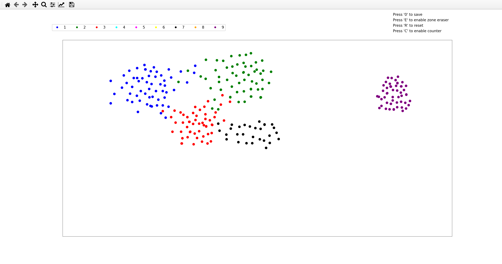
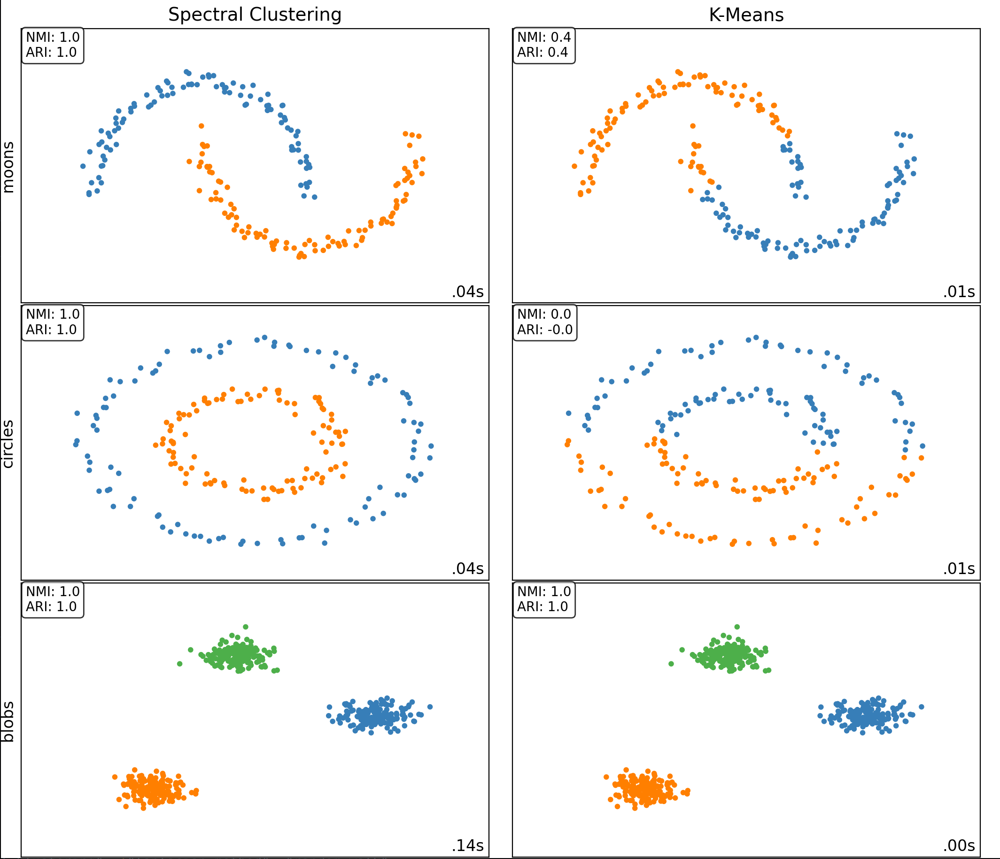

# Generalized Spectral Clustering Experiments Pipeline

This repository contains a GSC implementation in scikit-learn, alongside an experiment pipeline.

It serves as the official implementation for the paper [Generalized Dirichlet Energy and Graph Laplacians for Clustering Directed and Undirected Graphs](https://arxiv.org/abs/2203.03221). While it provides a framework for custom experiments, the exact experiments reported in the paper can be reproduced using `benchmark_uci.py`.

## Scikit-learn GSC Implementation

### Installation

Create a virtual environment and activate it (conda or venv):
```
python -m venv sklearn-env
source sklearn-env/bin/activate.fish
```

Install build dependencies:
```
pip install wheel numpy scipy cython meson-python ninja pyamg pyarrow 
```

Install scikit-learn in editable mode:
```
pip install -e scikit-learn \
          --no-build-isolation \
          --config-settings editable-verbose=true \
          --verbose 
```

### Usage of the Library

The scikit-learn fork is identical to the 1.8 version of scikit-learn except for the SpectralClustering class and related utilities.

Two new parameters are added to the API call for this class: `standard` (bool) and `laplacian_method` (str: "unnorm", "norm", "random_walk").

If `standard` is True, the adjacency matrix is symmetrized using $\frac{1}{2}(W + W^T)$ and the standard Laplacian is computed according to the specified method.

Otherwise, generalized spectral clustering is performed, using the specified method.

## Experiments

### Datasets interaction and creation

Datasets are stored in Hugging Face format, thus any dataset provided there can be imported via the `load_dataset()` function in `utils/file_manager.py`.
This pipeline also includes an interactive 2D labeled dataset builder. It is accessible via the `build_dataset()` function in `utils/dataset_builder.py`.



When you do not need a precise shape, you can also use the interface provided in `gmm.py` to quickly create customizable gaussian mixture (blob-like) datasets.

Datasets are saved using the `save_dataset()` function.
### Running Experiments

Once scikit-learn is installed, you can edit and run experiments using the template file `benchmark.py`.
An "experiment" consists of a combination of datasets to cluster with a given combination of methods, with fully customizable parameters.
The clusterings are then evaluated using the metrics of your choice (currently available: NMI, ARI, AMI, CH).
Three experiment "modes" are available:
- **Score**: Saves results as CSV double-entry tables for each metric
- **Visualization**: When all the datasets are 2D, we can plot the clusterings
- **Grid Search** : Perform a classical score experiment with grid search on specified parameters.


Please note that the `benchmark.py` file is the entry point for the exact benchmark reported in the paper's draft.
### Adding Custom Components

**New Clustering Methods** (`competitors/your_competitor.py`):
- Return sklearn-compatible object with `fit()` method and `labels_` attribute
- Add to `clusterer()` function in `experiments_utils.py`

**Vertex Measures and Neighbor Selection** (`competitors/measures.py` and `competitors/neighbors.py`):
- The measure integrated in the default GSC implementation is the $(\alpha, t)$-parametrized version : $\nu_{t,\alpha} = \left[\left[\mathbf{\tilde{P}}^t\right]^T \frac{1}{N} \mathbf{1}_{N \times 1}\right]^{\odot \alpha}$.
- Custom vertex measure and neighbor selection functions can be easily integrated into existing methods

Detailed guidelines for adding custom components are included in the related files.
